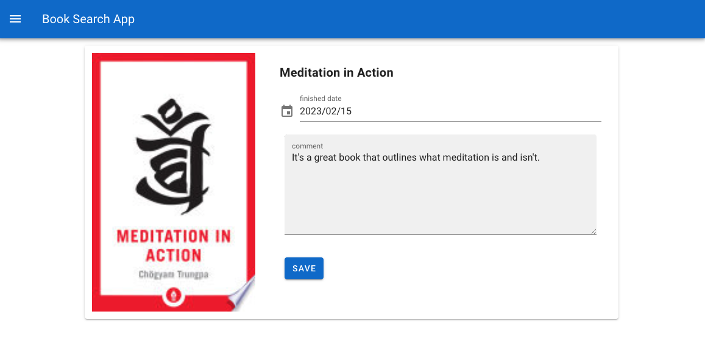
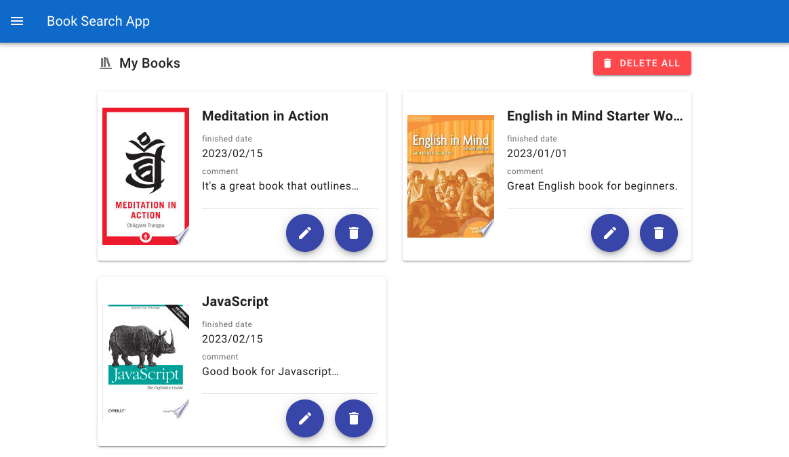

## :books: Book Search App

> This is an app that you can find books. You can keep the record of the books you finished reading.
> Demo link : [here](https://emiri-i.github.io/book-search-app/)

## :camera: Screen Shots





## :computer: Technologies Used

[](https://skillicons.dev)

## :star: Features

List the ready features here:

- You can find books by keyword, book title, and author name.
- You can keep keep the record of the books that you finished reading.

## :wrench: Setup

1. Clone this repository

```bash
$ git clone https://github.com/Emiri-i/book-search-app.git
```

2. Go into the repository

```bash
$ cd book-search-app
```

3. Install dependencies

```bash
$ npm install
```

4. Run the app

```bash
$ npm run serve
```

## :bulb: Room for Improvement

- Add Loading or spinner when fetch is running.
- Modify the image UI when there is no photos.

## :blue_book: License

[MIT](https://choosealicense.com/licenses/mit/)
